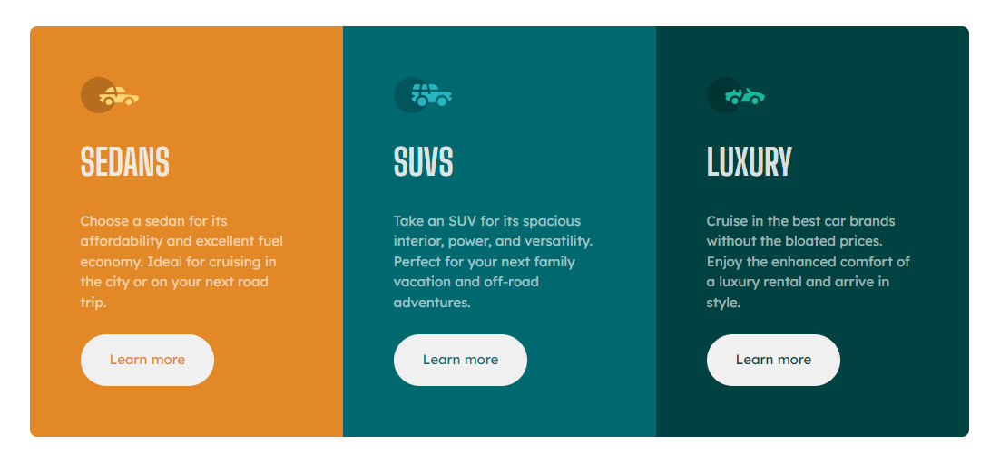
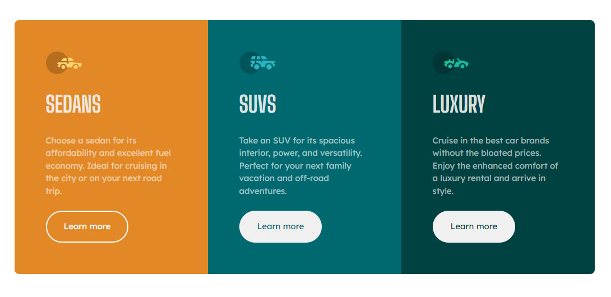

# Frontend Mentor - 3-column preview card component solution

This is a solution to the [3-column preview card component challenge on Frontend Mentor](https://www.frontendmentor.io/challenges/3column-preview-card-component-pH92eAR2-). Frontend Mentor challenges help you improve your coding skills by building realistic projects. 

## Table of contents

- [Overview](#overview)
  - [The challenge](#the-challenge)
  - [Screenshot](#screenshot)
  - [Links](#links)
- [My process](#my-process)
  - [Built with](#built-with)
  - [What I learned](#what-i-learned)
  - [Continued development](#continued-development)
- [Author](#author)

## Overview

### The challenge

Users should be able to:

- View the optimal layout depending on their device's screen size
- See hover states for interactive elements

### Screenshot

### Links

- Solution URL: [Add solution URL here](https://your-solution-url.com)
- Live Site URL: [Add live site URL here](https://your-live-site-url.com)

## My process

### Built with

- VSCODE
- CSS custom properties
- without framework
- Mobile-first workflow
- CSS grid
- CSS flexbox
- media queries
- eye sighting (no exact sizes were available except paragraphs)

**Note: These are just examples. Delete this note and replace the list above with your own choices**

### What I learned

Getting use to the CSS custom properties, HSL/HSLA color codes.

### Continued development

Fine tuning the variables, getting use to basic rem unit, instead of resetting it to 10px.
Custom CSS reset.

## Author

- Frontend Mentor - [@Pr3t0r](https://www.frontendmentor.io/profile/Pr3t0r)